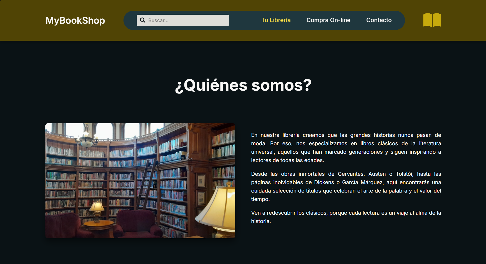
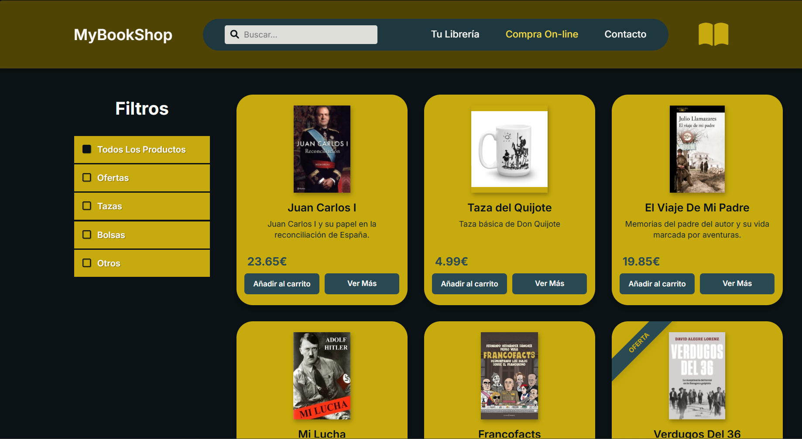
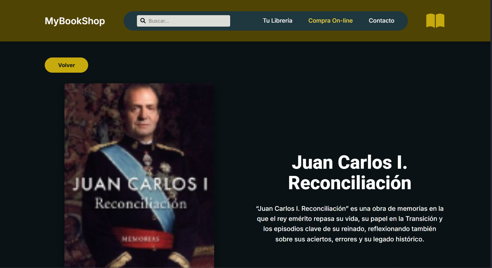
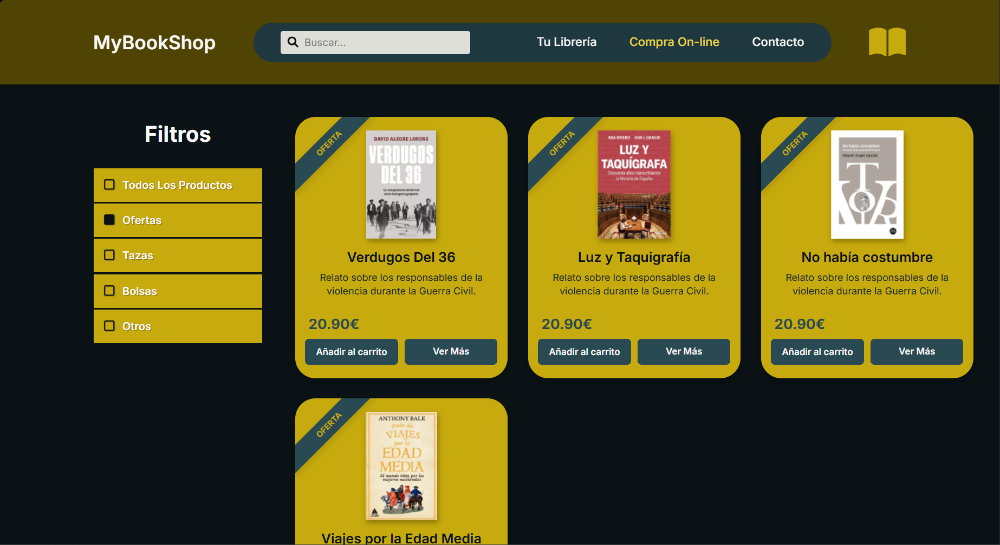

# Memoria de Práctica: Desarrollo de Interfaz Web "MyBookShop"

**Autor:** Sergio Ramírez Morón
**Asignatura:** Desarrollo de Interfaces Web
**Fecha:** 09/01/2026

---

## ¿Cómo se ha realizado?

Para la realización de esta práctica, he utilizando la inteligencia artifical de Gemini para generar el contenido de estos archivos excepto el README, los cuales han sido revisados y editados por mí para asegurar su calidad y adecuación a los requisitos de la práctica.

Para la ejecución del proyecto, el prompt que se le pasó a la inteligencia artificial se resume en enviarle el enunciado de la práctica principalmente, junto con algunas instrucciones que debía seguir como basarse 100% en el diseño que se proporcionaban en las imagenes de Figma, usar HTML y CSS, no crear el diseño responsive, utilizar lenguaje claro y sencillo y dividir el proyecto en varios archivos para cada vista. Le dije que empezariamos creando el index, y ya de ahí, seguiríamos avanzando poco a poco.

## 1. Objetivo

El objetivo principal de esta práctica ha sido la implementación de la interfaz de usuario para la librería "MyBookShop", basándome en los mockups de diseño creados anteriormente en Figma.

Para llevarlo a cabo, se ha asegurado:

- Uso de **HTML** para una buena estructura.
- Uso de **CSS** avanzado (Variables, Flexbox y Grid).
- Fidelidad visual respecto al diseño original.

El proyecto consta de tres vistas funcionales:

1.  **Página Principal (index.html):** Landing page con carrusel y localización.
2.  **Tienda (tienda.html):** Catálogo de productos con filtros y rejilla.
3.  **Detalle de Producto (vista.html):** Ficha técnica visual del libro seleccionado.

---

## 2. Desarrollo paso a paso

### Paso 1: Estructura y Base HTML

Lo primero que realicé fue definir el HTML común para todas las páginas. Para cumplir con los requisitos pedidos, utilicé las etiquetas adecuadas pedidas por la práctica:

- `<header>`: Contenedor de la cabecera.
- `<nav>`: Para la navegación principal.
- `<main>`: Para el contenido único de cada página.
- `<footer>`: Para el pie de página.
- `<section>` y `<article>`: Para organizar los bloques de contenido y las tarjetas de producto.

También importé las fuentes desde Google Fonts (**Roboto** para títulos y **Inter** para textos) y la librería **FontAwesome** para los iconos de interfaz.

### Paso 2: CSS

Para asegurar un código escalable, se creó el archivo `style.css` definiendo las variables de color y tipografía en el bloque`:root`. Esto facilita cambios rápidos y mantiene la coherencia en la página.

Se definieron variables como `--primary-500` (Dorado), `--secondary-900` (Fondo oscuro) y `--secondary-600` (Azul oscuro).

### Paso 3: Header y Footer

Estos elementos debían ser idénticos en todas las páginas.

- **Header:** Utilicé **Flexbox** para alinear el logo, la barra de navegación y el icono del libro. Una dificultad fue crear el óvalo para la navegación central; lo logré aplicando un `background-color` azul oscuro y `border-radius: 50px` al contenedor `<nav>`, separándolo visualmente del fondo oscuro del header con márgenes.
- **Footer:** Añadí un **Grid** de 3 columnas iguales para distribuir el logo, el contacto y los enlaces. Para el copyright, utilicé `position: absolute; bottom: 20px;` para centrarlo en la parte de abajo del contenedor.

### Paso 4: index.html

La página principal se dividió en tres secciones:

1.  **¿Quiénes somos?:** Es un Grid de 2 columnas que equilibran la imagen de la librería y el texto descriptivo sobre el fondo oscuro.
2.  **Nuestros Productos:** Añadí carrusel horizontal. Utilicé un contenedor con `display: flex` y `overflow-x: auto` para permitir el desplazamiento, ocultando la barra de scroll para una mejor estética. Añadí un pequeño script de JavaScript para controlar el desplazamiento mediante los botones de flecha.
3.  **Encuéntranos:** Repliqué la estructura de la primera sección para mostrar el mapa y la lista de tiendas físicas.
    También se han añadido enlaces reales a localizaciones de Google Maps que te redireccionan directamente a la ubicación de las tiendas.

### Paso 5: tienda.html

Esta fue la sección más dificil de crear. Se usó un Grid de dos columnas, una barra lateral fija para los filtros y el área para los productos.

**Tarjetas:**
Las tarjetas debían tener un diseño muy específico.

- Fijé sus dimensiones a `314px` de ancho y `386px` de alto para que fuese igual que en Figma.
- Usé Flexbox en dirección columna para organizar el contenido interno.
- Usé `margin-top: auto` en los precios y botones para asegurar que siempre se mantuvieran alineados al fondo de la tarjeta.
- Para la cinta de Oferta, usé un elemento `` con posición absoluta y rotación con css.

### Paso 6: vista.html

Creé una página para ver el detalle de un libro. Reutilicé el header y footer y diseñé el layout:

- Una imagen grande a la izquierda, ocupando todo su espacio sin deformarse.
- Títulos de buen tamaño y descripción centrada a la derecha.
- Transformé los botones de "Ver Más" de la tienda en enlaces que navegan a esta vista.

---

### Paso 7: tiendaFiltro.html

Creé una versión alternativa de la tienda que muestra solo los productos en oferta. La estructura es idéntica a `tienda.html`, pero con un filtro aplicado.

